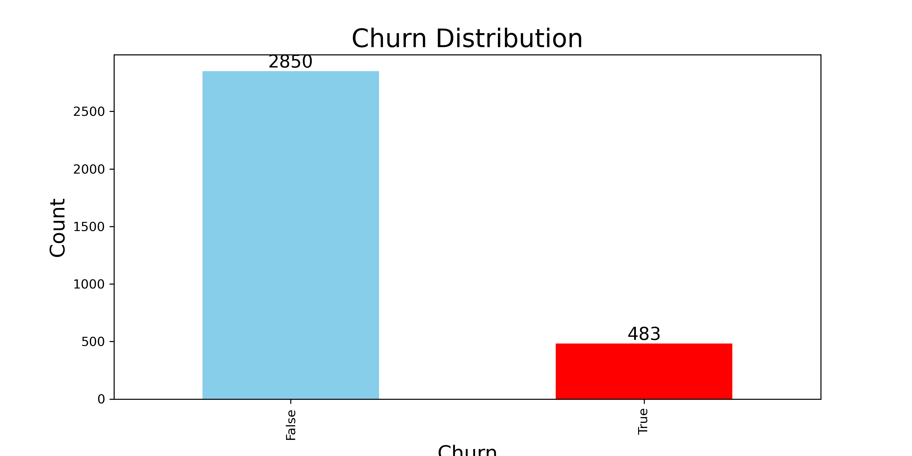
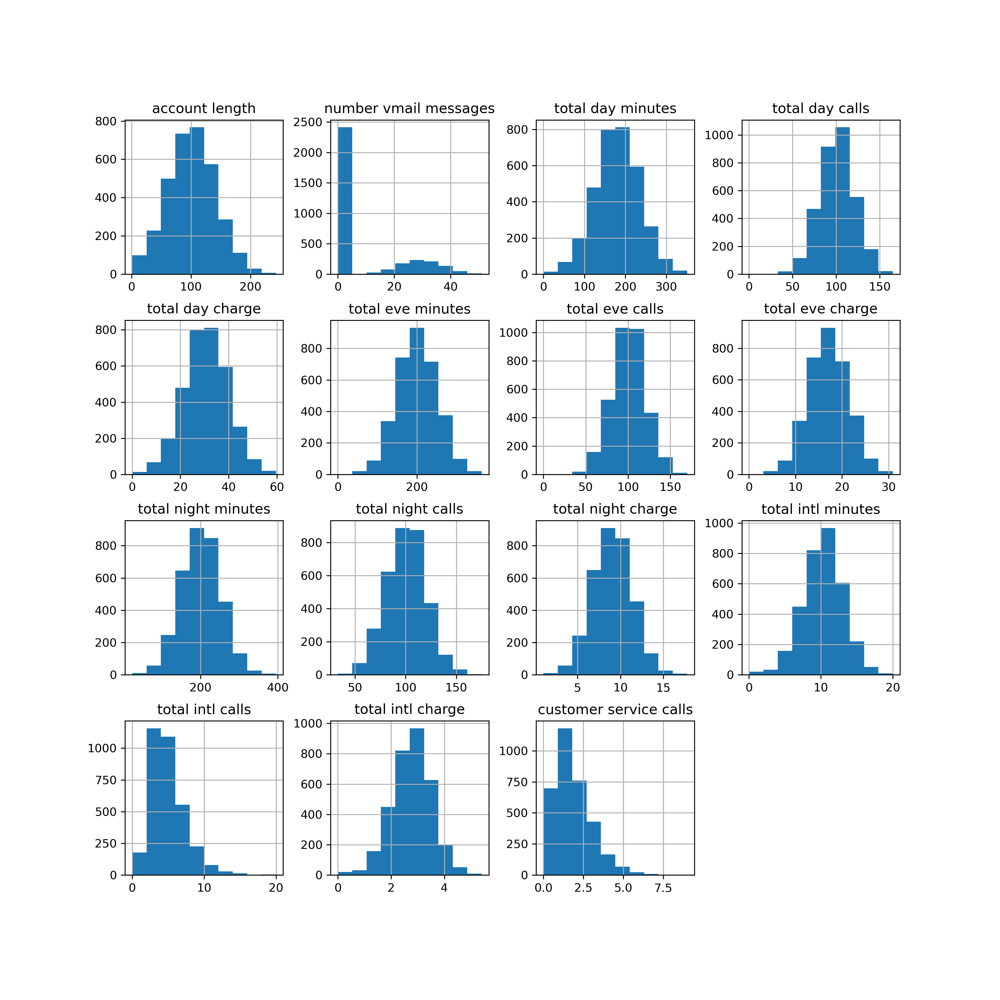
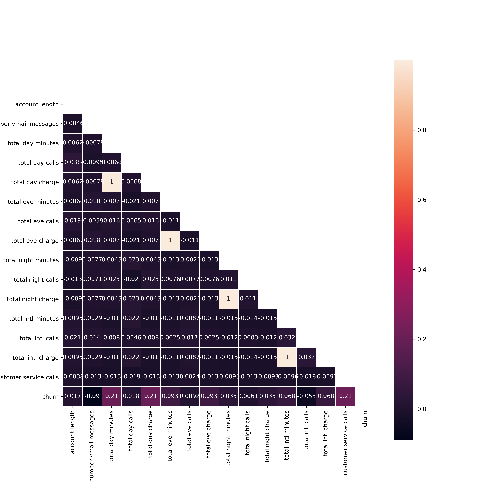
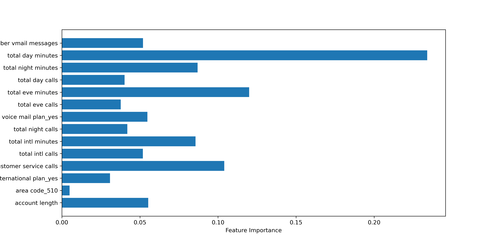

# SYRIATEL CUSTOMER CHURN
Author: Sylvester Magunda

## Project Overview
This project leverages machine learning algorithms to construct a predictive model that accurately identifies customers at risk of churning. The data was obtained from [Kaggle](https://www.kaggle.com/datasets/becksddf/churn-in-telecoms-dataset). It encompasses 20 predictor variables, primarily related to customer usage patterns, containing 3,333 records. Among these, 483 customers are categorized as churners, while the remaining 2,850 are non-churners. The model's objective is to classify the target variable "churn", leading to the application of classification algorithms. Model performance evaluation relies on the metric of recall. Generally, the best model is the decision tree with fine-tuned hyperparameters

## Business Problem
For telecommunications companies, expanding their revenue-generating base hinges on both acquiring new customers and improving customer retention rates. Among the most significant concerns for large enterprises is the issue of customer churn. Syriatel, a provider of mobile telecommunication and data services based in Damascus, Syria, offers a range of services encompassing calls, messaging, GSM, and internet services. The company has built a strong reputation by prioritizing customer satisfaction and social responsibility. Syriatel has recognized the effectiveness of nurturing long-term customer relationships over continually acquiring new customers. They understand that retaining a client is often more cost-effective than acquiring a new one. Consequently, churn prediction has become a pivotal component of the company's strategic initiatives. This project seeks to develop a model that accurately predicts customers most likely to churn while identifying the key features that contribute to this prediction. With this insight, Syriatel can take proactive measures to prevent potential churn among their customers.

## Data Understanding
A class imbalance issue is noticed from the uneven distribution of observations within the target class. Specifically, 85.51% of the data pertains to the "False" class, while the "True" class comprises 14.49% of the dataset.

The dataframe has both continuous and categorical variables.

Scaling varies among the features, and some of them do not exhibit a normal distribution. Consequently, it is necessary to perform both scaling and normalization on the features.

Most features exhibit a notably weak correlation with each other.
Nonetheless, a perfect positive correlation is observed between specific pairs of variables: total evening charge and total evening minutes, total day charge and total day minutes, total night charge and total night minutes, and total international charge and total international minutes. This correlation is anticipated since the charge of a call is inherently influenced by the call's duration in minutes. To address multicollinearity, it will be necessary to eliminate one variable from each correlated pair.

## Data Preparation for Machine Learning
- To mitigate multicollinearity among features, columns displaying total charges at various times are removed from the dataset.
- The dataset is divided into training and testing subsets using a train-test split.
- Categorical variables are converted into dummy variables to prepare them for modeling.
- Addressing class imbalance, Synthetic Minority Over-sampling Technique (SMOTE) is applied to oversample the minority class by generating synthetic examples with replacement.

## Modeling
Multiple models are constructed including: logistic regression, k-nearest neighbors, decision tree, and random forest. The hyperparameter tuning process is employed for the decision tree to create the best model. To safeguard against data leakage, a pipeline is implemented, ensuring that data scaling takes place seamlessly within the pipeline.

## Evaluation
The decision tree model with fine-tuned hyperparameters exhibits superior performance, boasting the highest recall score, with accuracy and precision scores surpassing the mean values. 
However, it's worth noting that the achieved recall score falls slightly below the set threshold of at least 85%. 
Below, you can find the feature importance of this top-performing model.

## Conclusions and Recommendations
The chosen model for predicting customer churn is the decision tree with fine-tuned hyperparameters, boasting the lowest count of false negatives.

The key features crucial for forecasting customer churn are as follows:
- Total day minutes: Reflecting the cumulative minutes spent by the customer on daytime calls.
- Total evening minutes: Summing up the minutes spent on evening calls by the customer.
- Customer service calls: Signifying the number of calls the customer has initiated to reach customer service.

To meet customer expectations effectively and assess customer interactions, Syriatel should ensure a robust customer service strategy. This entails tracking and addressing both positive and negative feedback received from customers.

Furthermore, the correlation reveals that customer service calls has the highest correlation with churn implying that the more times a customer initiates a call to reach customer service the more likely they are to churn. Therefore, Syriatel should always ensure that they solve the issues raised by clients who call.

Since total day and night minutes are among the key factors for predicting churning, the company should assess its call charge rates in comparison to competitors. Lowering the charges per minute for calls could prove instrumental in retaining customers and preventing churn.

## Next Steps
Despite the hyperparameter tuning, the best-performing model falls short of the desired 85% recall score. Overfitting remains a challenge in the model's performance. To mitigate this overfitting issue and enhance the model's effectiveness, it is advisable to increase the size of the training dataset.

##  For More Information
See the full analysis in the [Jupyter Notebook](https://github.com/SylvesterMagunda/syriatel-customer-churn/blob/main/syriatel-customer-churn.ipynb) or review this [presentation](https://github.com/SylvesterMagunda/syriatel-customer-churn/blob/main/customer-churn-presentation.pdf)
.
For additional information, contact Sylvester Magunda at sylvestermagunda@gmail.com
